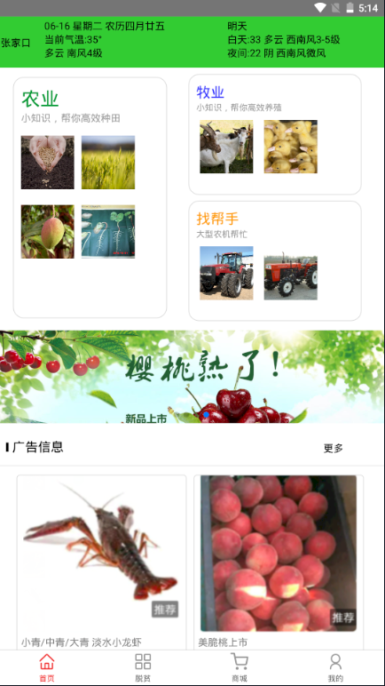
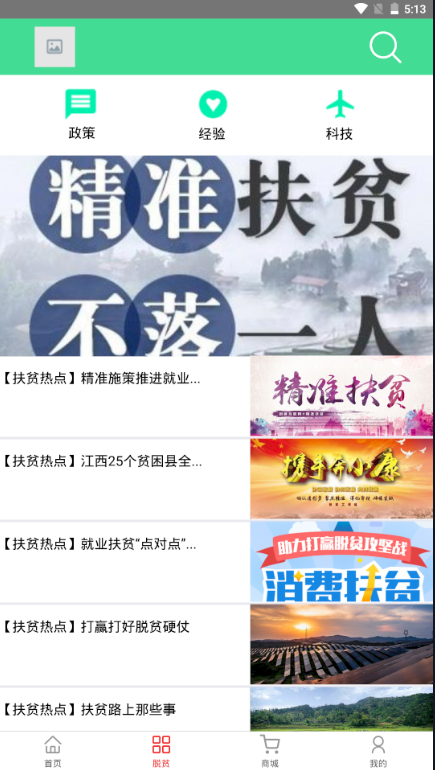
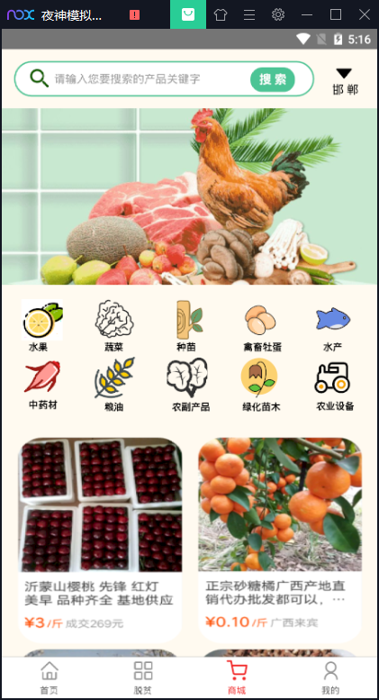
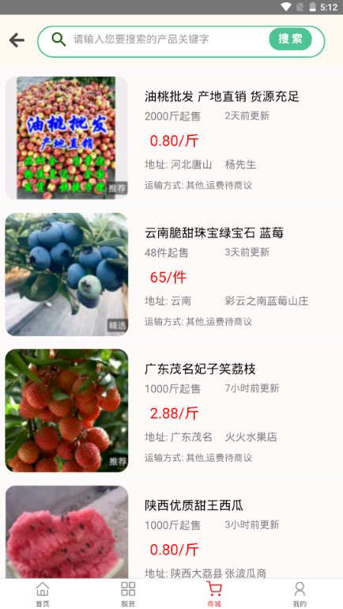
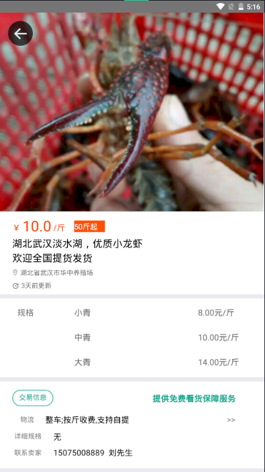

# 2017级项目实训成果展示 

## 《利农》 -  HTML5与移动互联网开发

###  项目简介

利农是一款致力于农业发展的app，集农业知识传播、农机租赁，农牧产品销售于一体。致力于解决农民在生产中面临的农产品滞销，农忙时农机租赁困难，科学种植、养殖等方面的问题。同时面对国家脱贫攻坚决战决胜的关键阶段，对最新脱贫政策进行相关的推荐。

### 项目成员

- 吕锋、秦晓旭、冯邵一、穆龙云、吴晓岛、黄天润、柳江浩

#### 展示视频

- [项目展示视频](https://www.bilibili.com/video/BV1mD4y1D7sG)

### 项目截图

  
  
  

  
  

