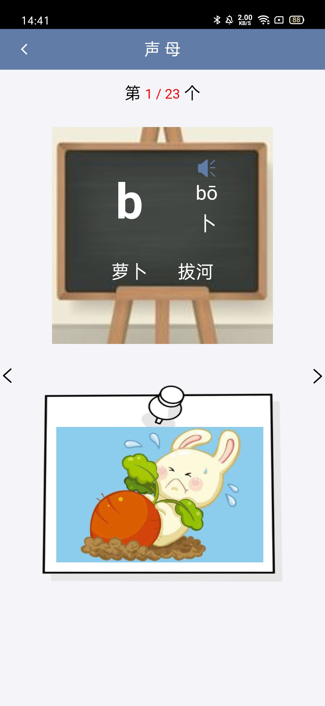

# 2017级项目实训成果展示 

## 《小语文》 -  HTML5与移动互联网开发

###  项目简介

小语文是一款专注于小学拼音、成语和诗词学习的App。软件采用学练结合的方式，配有形象的插图和语音播放功能，能够随机出题并记录每次的成绩。为细化拼音学习功能，在小语文App的基础之上开发了拼音岛小程序，包括单复韵母、鼻韵母、听音选字等六个板块的知识学习与练习。

### 项目成员

- 王炎、姜皓天、卢毅双、王丽娜、王心彤

#### 展示视频

- [项目展示视频](https://www.bilibili.com/video/BV1mz411i71X)

### 项目截图

  
  
  

  
  
  

  
  
  

  

