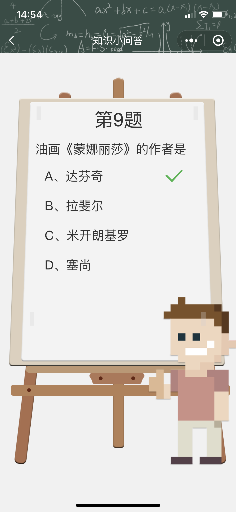

# 2017级项目实训成果展示 

## 《涂鸦像素》 -  HTML5与移动互联网开发

###  项目简介

涂鸦像素是一款集益智、娱乐、工具集一身的小程序。他简化了绘画难度，让绘画变得简单上手，任何人都可以简单的完成一幅画的绘制、体会绘画带来的乐趣。本程序分为WebApp端和小程序，WebApp端注重操作的简单，提供游戏社区让玩家进行讨论与分享；小程序端注重功能的优化，提供将图片转为像素的功能。

### 项目成员

- 夏炜轩、司涵、李沛伦、侯瑞琪、张晓焕

#### 展示视频

- [项目展示视频](https://www.bilibili.com/video/BV1Rp4y1D7aU)

### 项目截图

  
  
  

  
  
  

  
  

