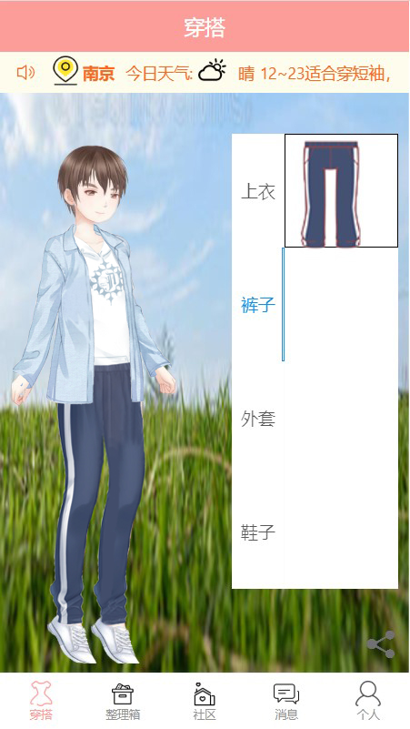
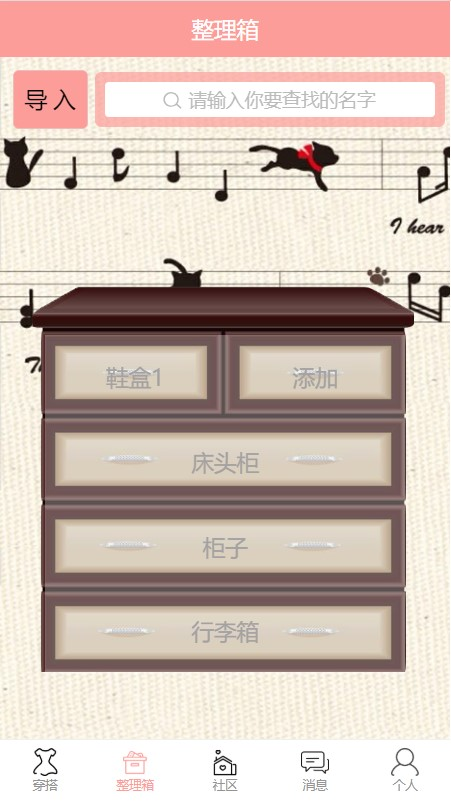
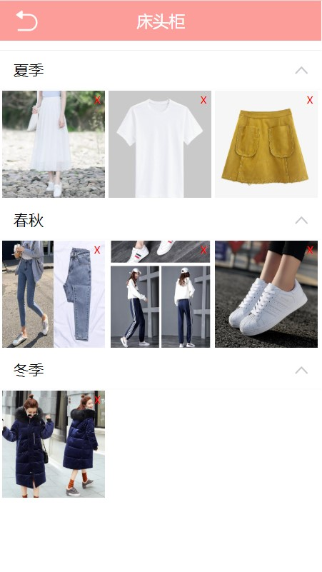

# 2017级项目实训成果展示 

## 《衣舍》 -  HTML5与移动互联网开发

###  项目简介

衣舍是一款以衣物存储、换装穿搭为主要功能的的实用类App，用来解决青年人衣物存放位置混乱，换季期间穿搭困难等问题。除了极具趣味性地结合了现实衣物存储和虚拟建模穿搭的功能，还打造了社区论坛、实时聊天室等众多功能。

### 项目成员

- 裴雨萌、张卓、王盼、郜瑞雪、李爽

### 项目截图

  
  
  

  
  

