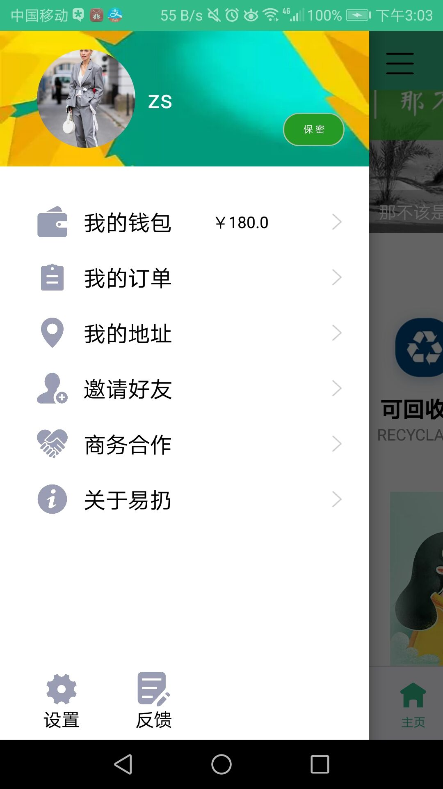
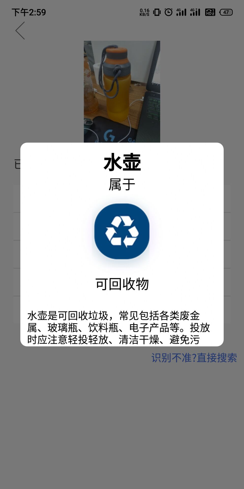
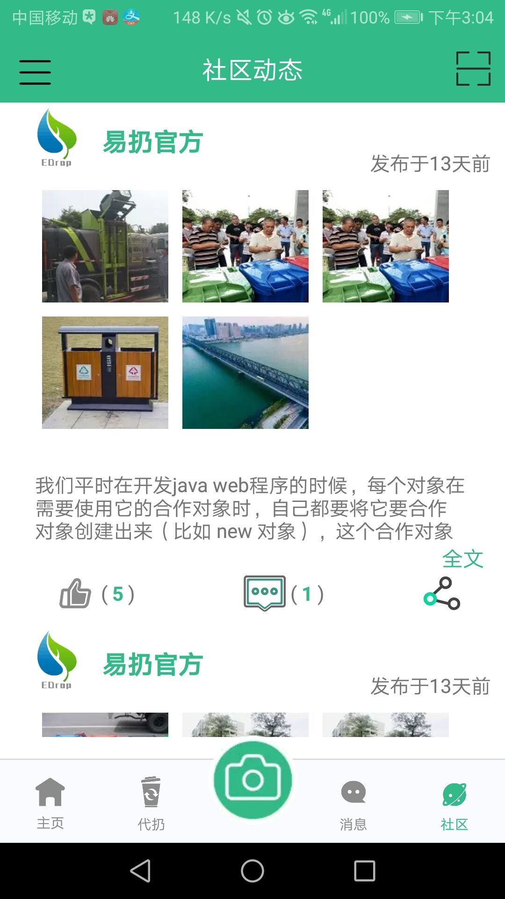
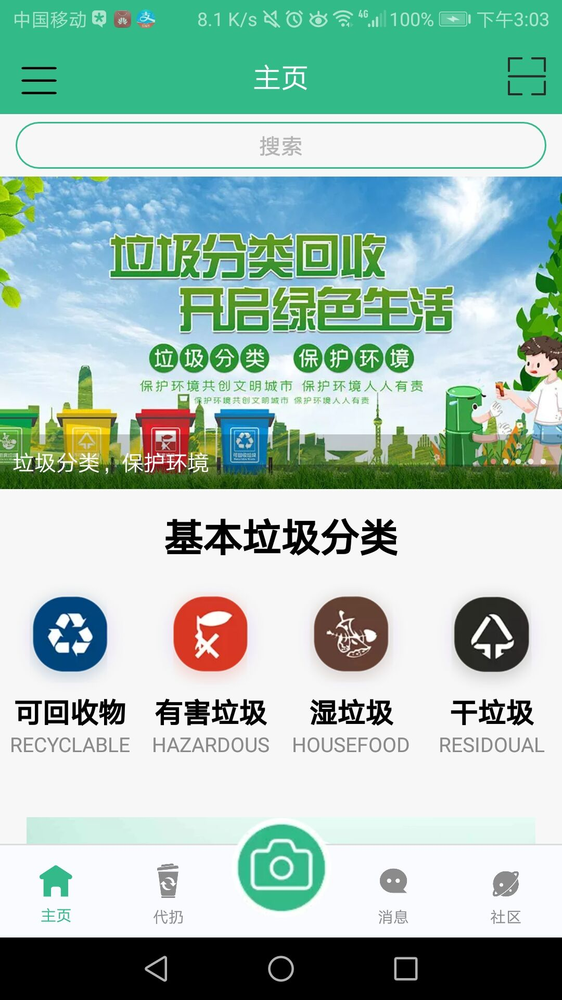
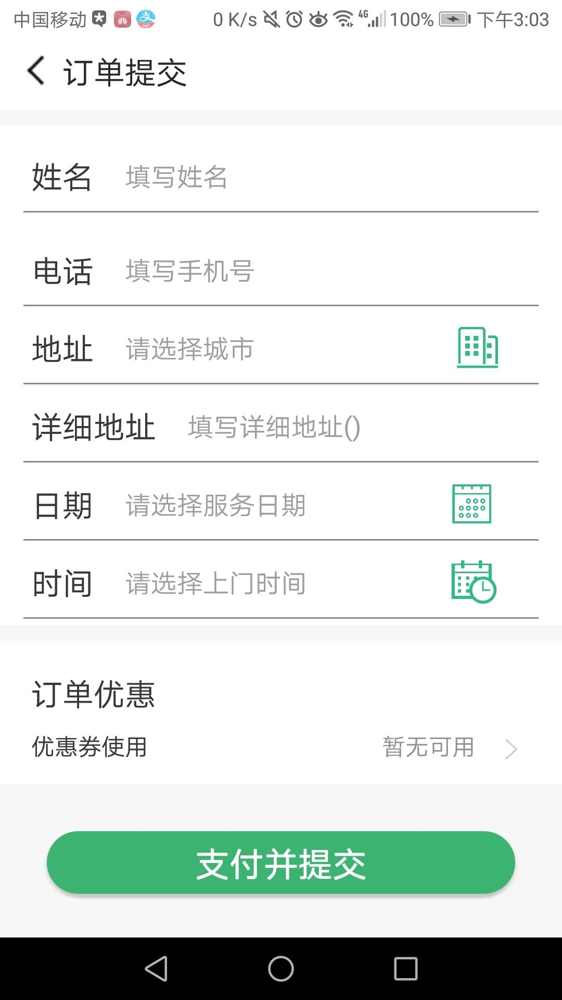
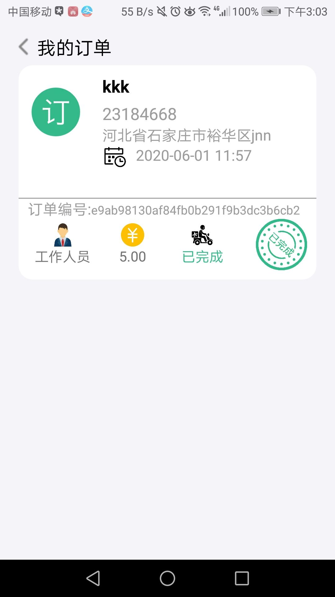

# 2017级项目实训成果展示 

## 《EDrop》 -  Java与移动智能设备开发

###  项目简介

随着垃圾分类条例越来越精细，生活垃圾正确分类和处理对普通市民来说越来越困难。基于此背景，de_dust2 小组开发了《EDrop》—— 一款方便进行垃圾分类和垃圾处理的 APP。

### 项目成员

- 张浩宇、张晨旭、康晓慧、王明杰、李诗凡、刘潭

#### 展示视频

- [项目展示视频](https://www.bilibili.com/video/BV1xz411e7uZ)

### 项目截图

  
  
  

  
  
  

