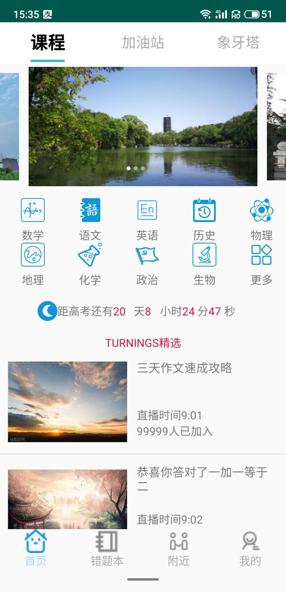
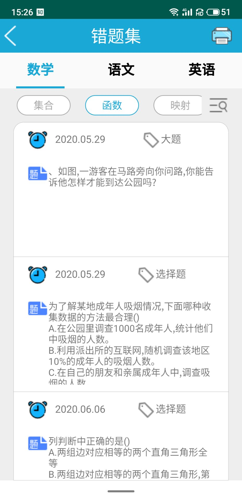
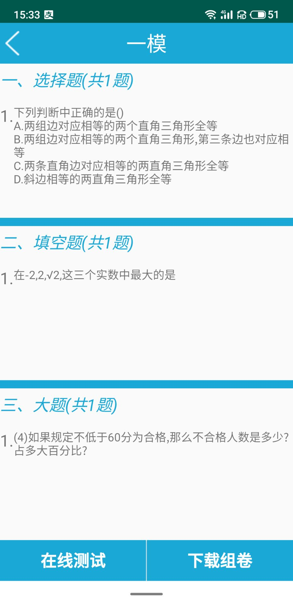
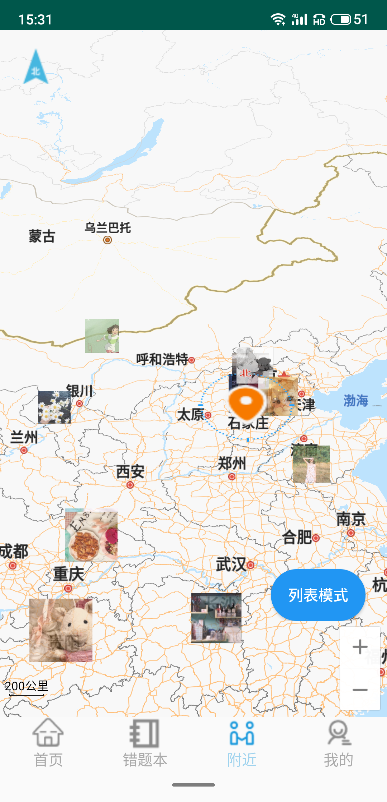
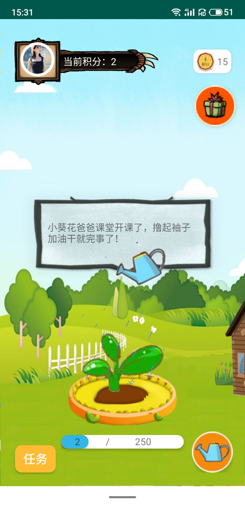

# 2017级项目实训成果展示 

## 《小葵花》 -  Java与移动智能设备开发

###  项目简介

“小葵花”软件是一款高中生错题整理的学习宝典。提供海量学习课程，错题一键录入，智能分类管理，自主组卷下载打印，在线考试，多维错题分析，线上交友互动，更有庄园游戏寓教于乐，告别传统错题模式，名师高校尽在掌握。

### 项目成员

- 单鑫楠、王爽、吕怡浩、金鑫媛、杨柳鑫、刘鹏辉、郭伟

#### 展示视频

- [项目展示视频](https://www.bilibili.com/video/BV1qK411p7gP)

### 项目截图

  
  
  

  
  

