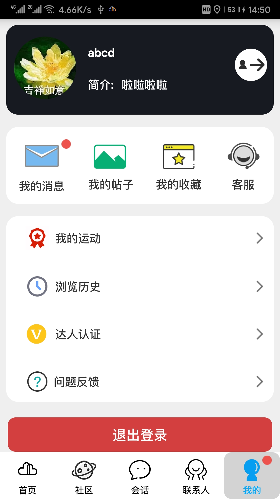
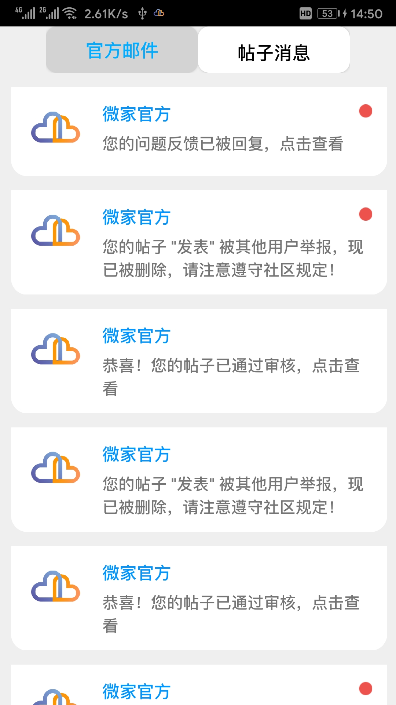
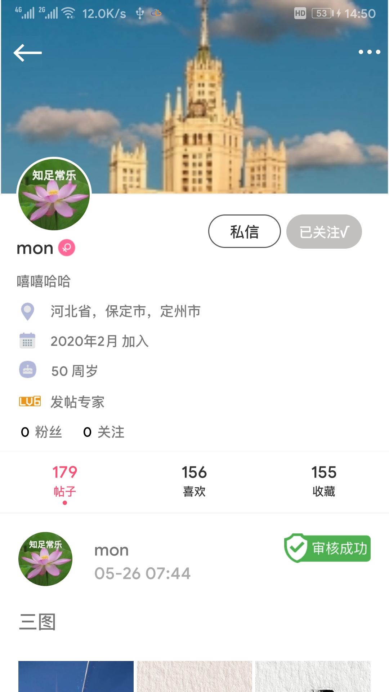
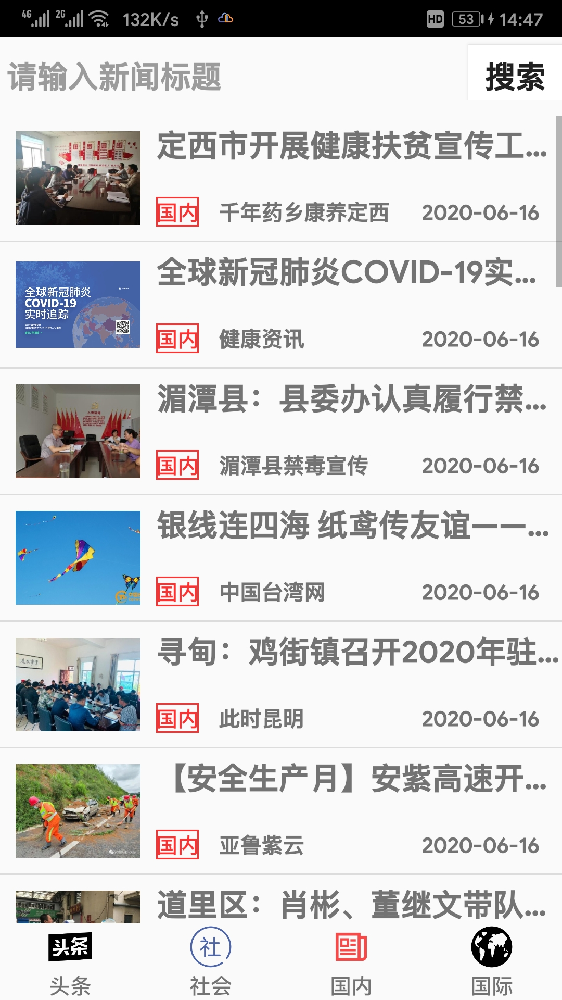
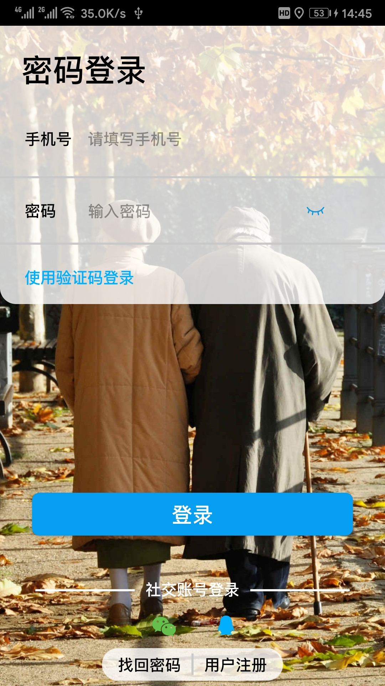
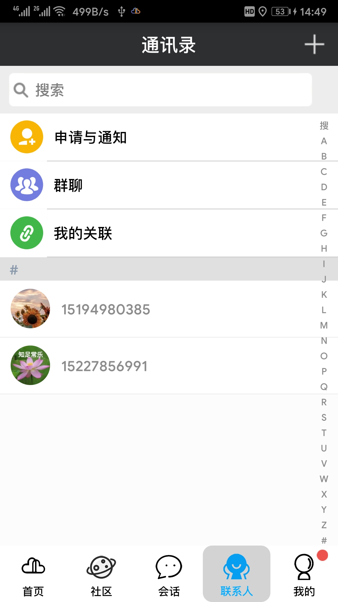

# 2017级项目实训成果展示 

## 《微家》 -  Java与移动智能设备开发

###  项目简介

微家是一款关注中老年人安全、丰富中老年人娱乐生活的APP。子女能查看父母实时、历史轨迹，为父母设置远程闹钟及与父母音视频通话；戏曲老歌、相声评书、美文新闻，应有尽有；休闲社区，陌生朋友，天南海北畅所欲言。

### 项目成员

- 靳朋朝、姬文斌、王谋、王子威、章鹏、赵铭哲

### 项目截图

  
  
  

  
  
  

  
  
  

  
  
  

  
  
  

  
  
  

  
  

