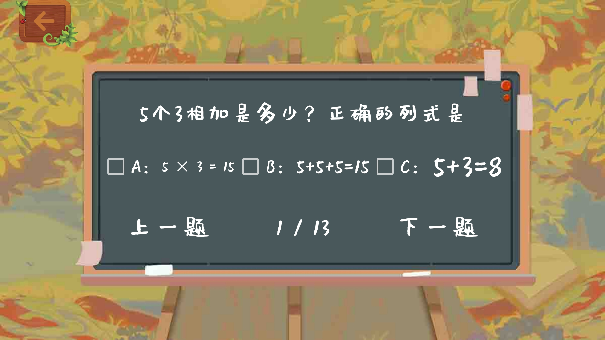
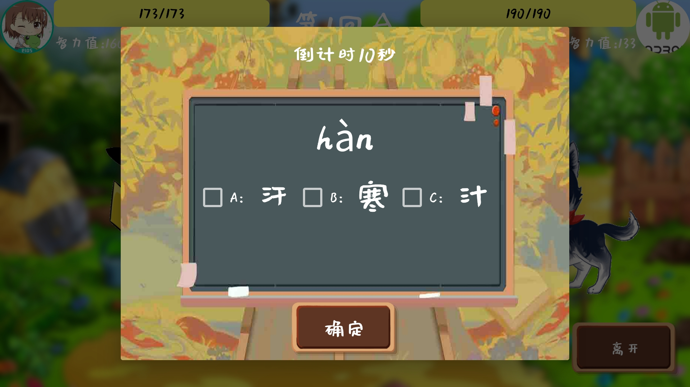
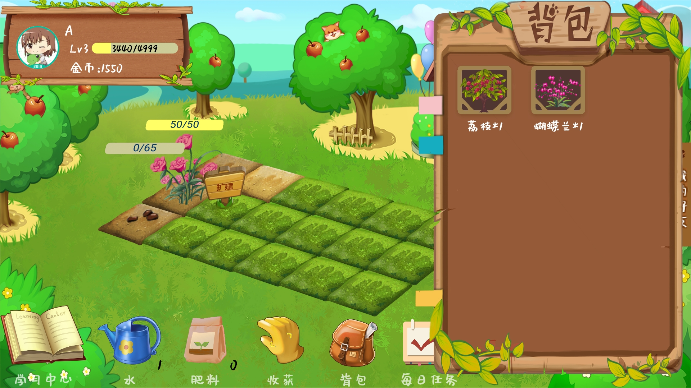
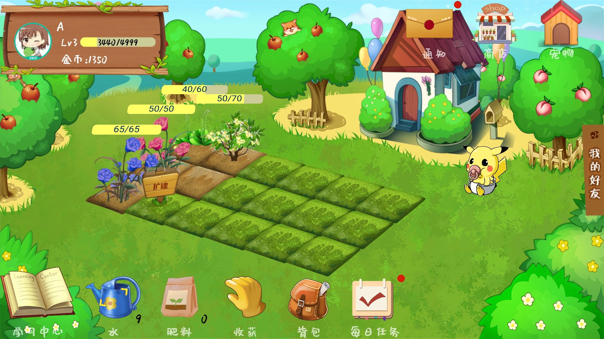
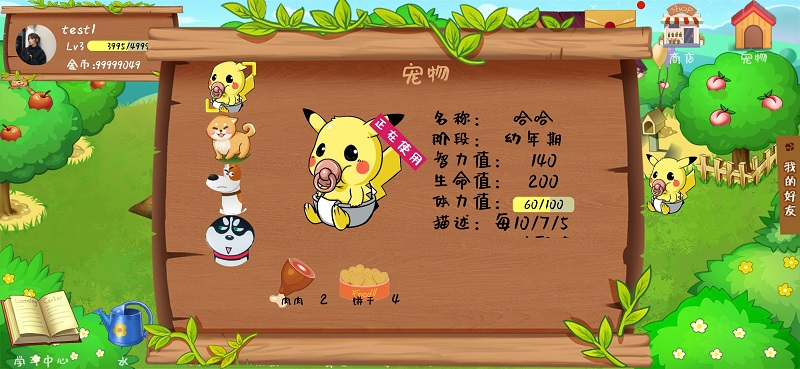
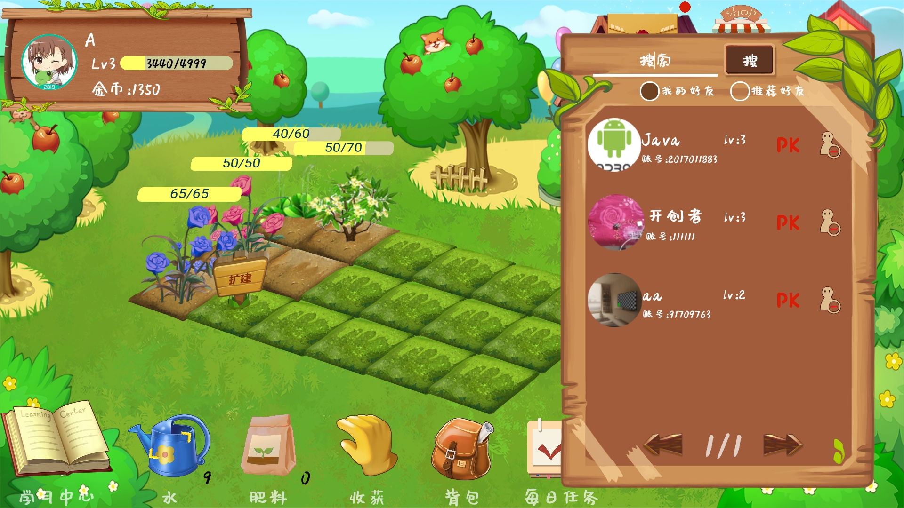
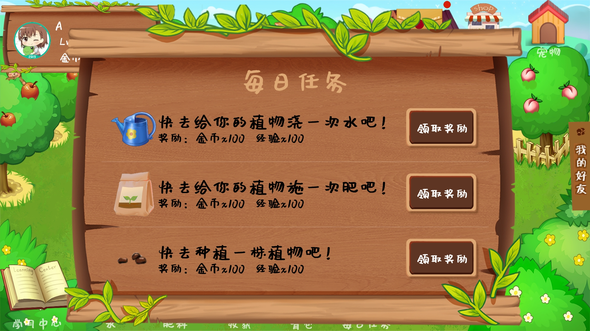

# 2017级项目实训成果展示 

## 《知识农场》 -  Java与移动智能设备开发

###  项目简介

知识农场是一款面向一到三年级小学生群体的养成类游戏。通过游戏的方式来促进孩子学习与巩固知识，降低了孩子对学习的抵触心理，旨在让学习知识成为轻松游戏的额外赠品。

### 项目成员

- 李和谦、孙建旺、张帅华、景光赞、杨云婷（美术与设计学院）、乔开元（美术与设计学院）

### 项目截图

  
  
  
  
  
  
  
  

