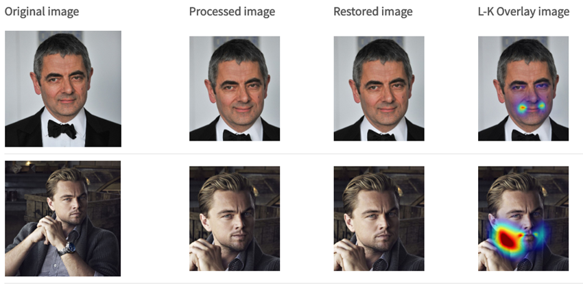
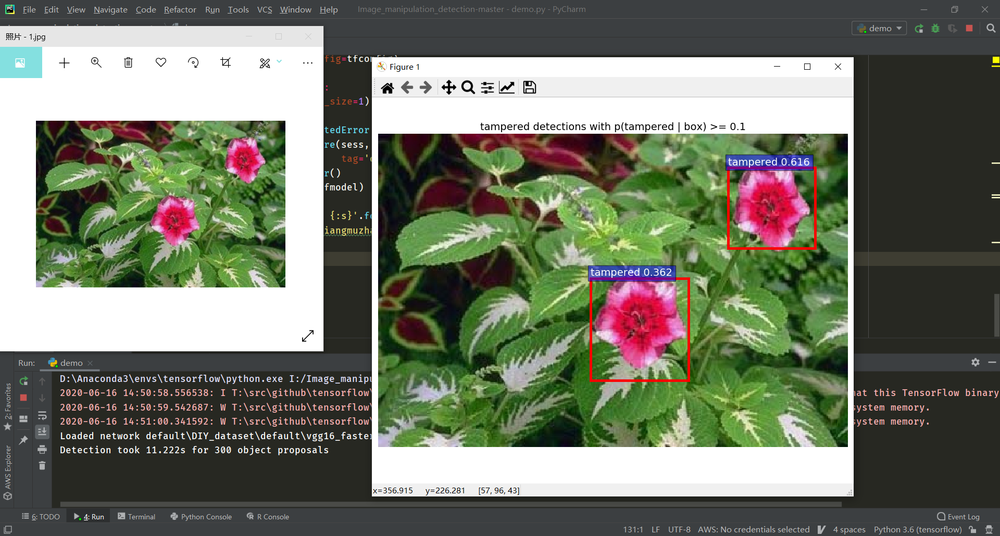
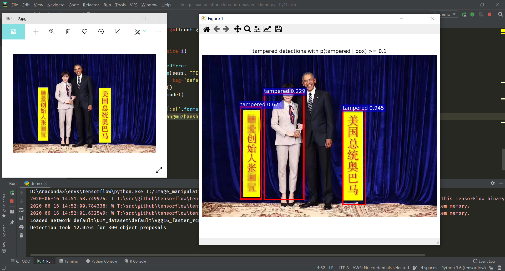
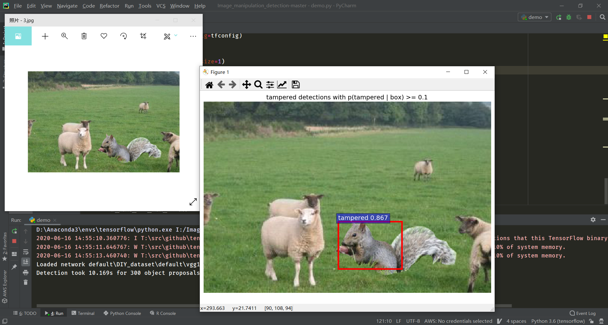
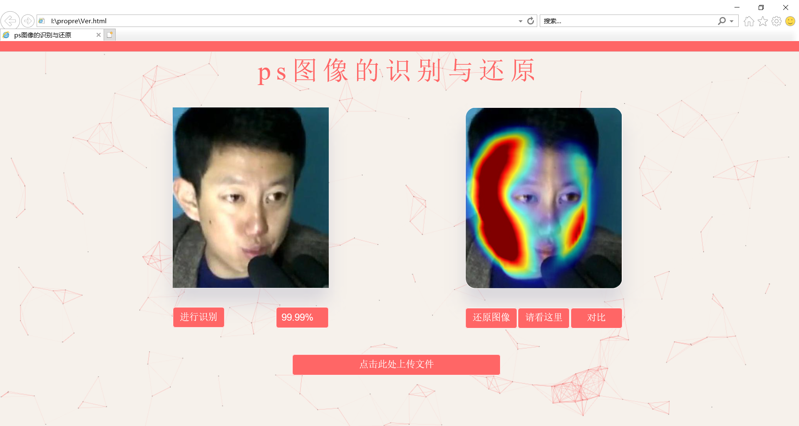
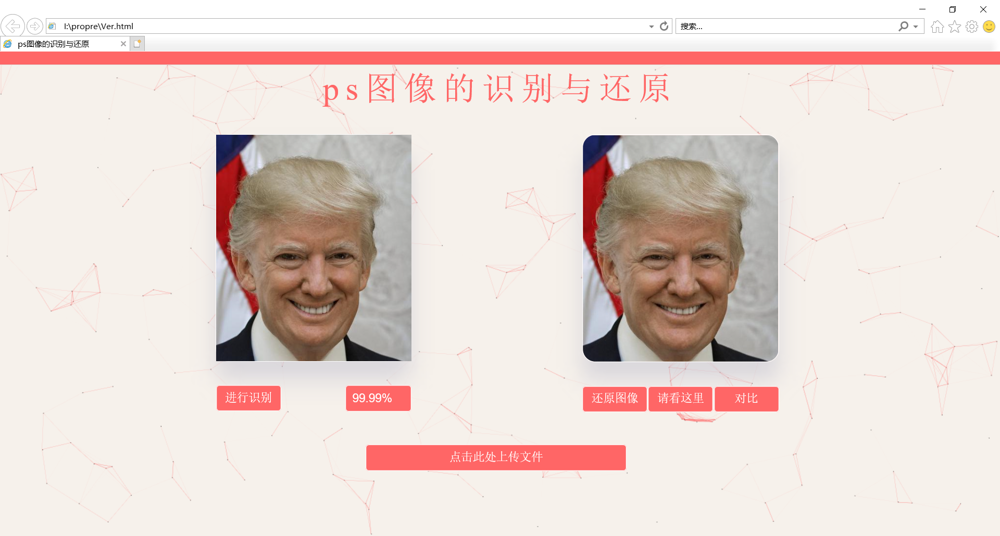
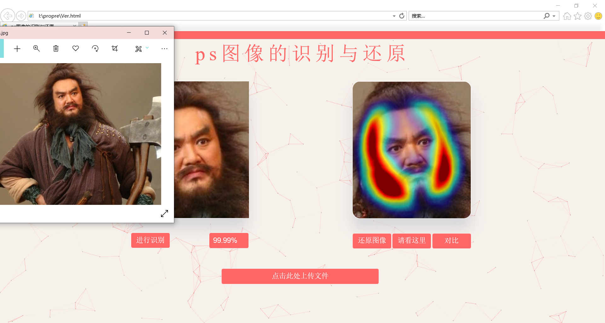

# 2017级项目实训成果展示 

## 《PS识别与还原》 -  人工智能

###  项目简介

毁图秀秀——PS识别与还原是一款能够对伪造图像进行识别与还原的工具。它拥有两种模型，四种形态，无论是微博里明星的精修照、还是朋友圈里把背景都P歪了的自拍，它都可以一键识别还原。

### 项目成员

- 籍家荣、邬洲、张炳辰、孙培钧

#### 展示视频

- [项目展示视频](https://www.bilibili.com/video/BV1gz4y1R7jp)

### 项目截图

  

  

  

  

  

  

  

  

