# 2017级项目实训成果展示 

## 《智能垃圾分类识别》 -  人工智能

###  项目简介

当下我国正在全力推广垃圾分类，准确的垃圾分类投放既是美化城市的要求，又是每个家庭不得不履行的责任与负担。为此，智能垃圾分类识别小程序诞生了，它可以通过拍照识别、语音识别、文字识别等方式快速、准确识别垃圾类型，解决您的垃圾分类难题。

### 项目成员

- 张依梦、李炳文

### 项目截图

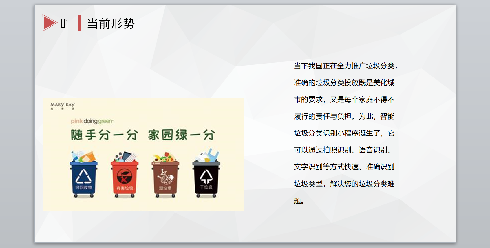

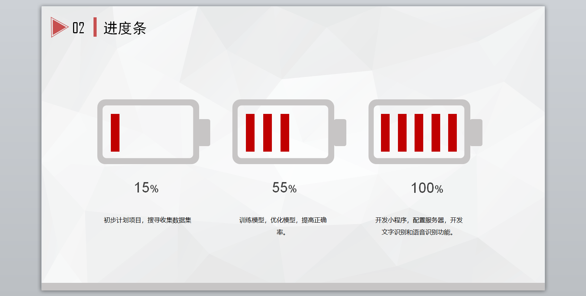

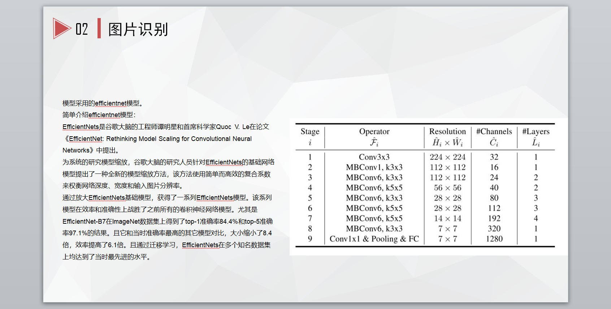

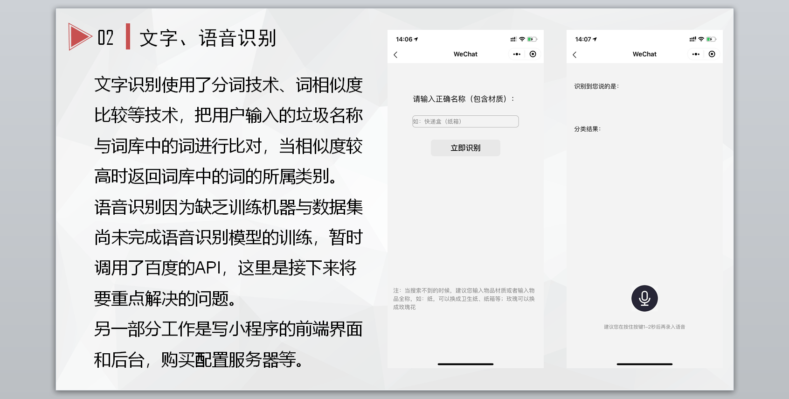

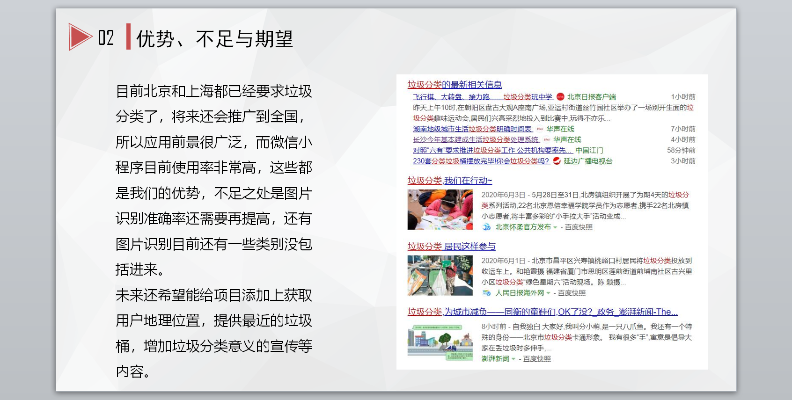

  
  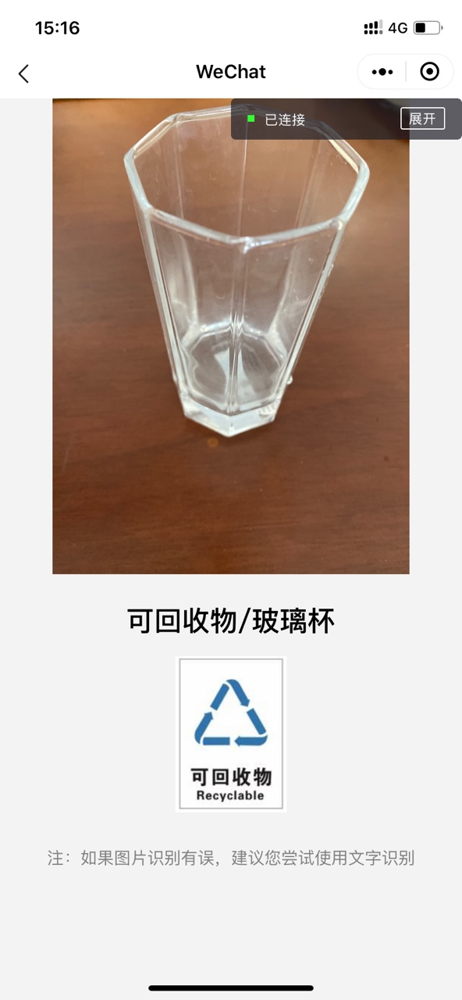
  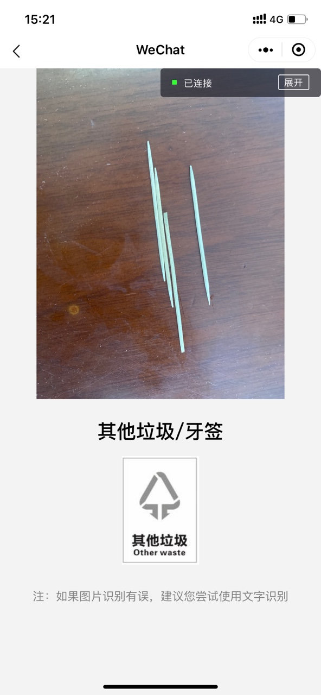

  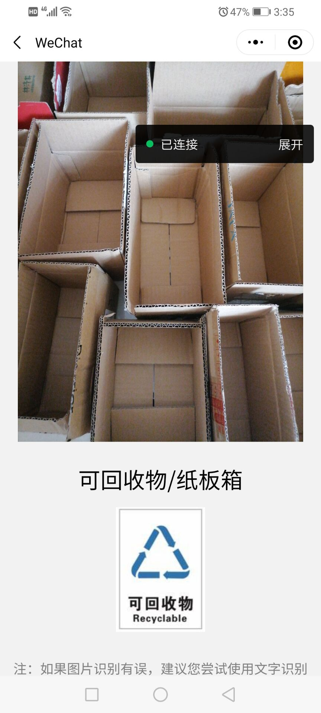
  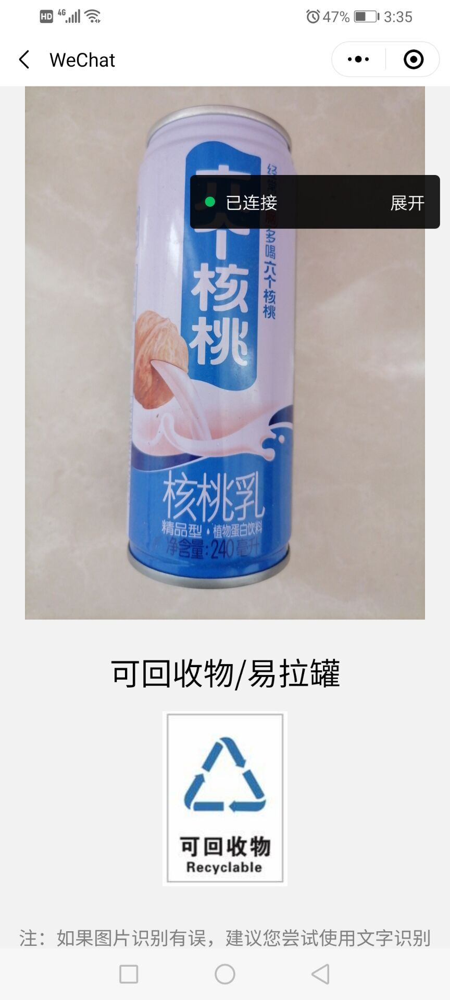
  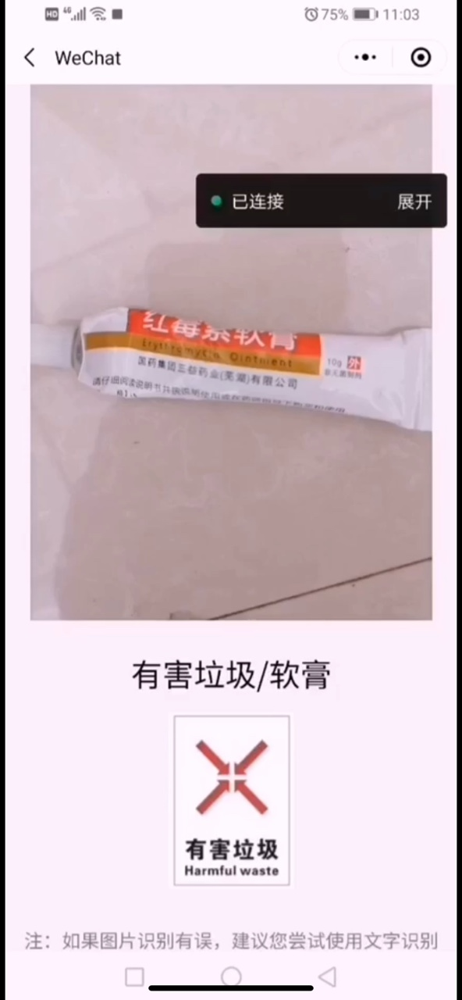

  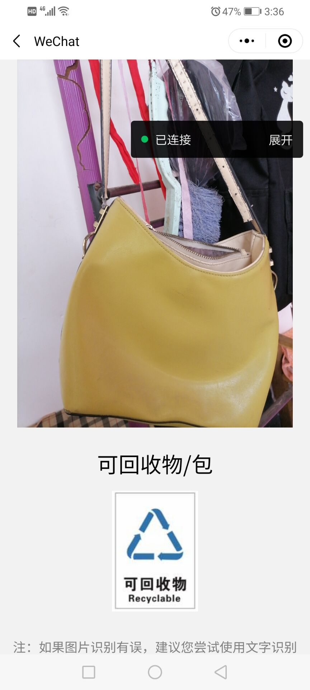
  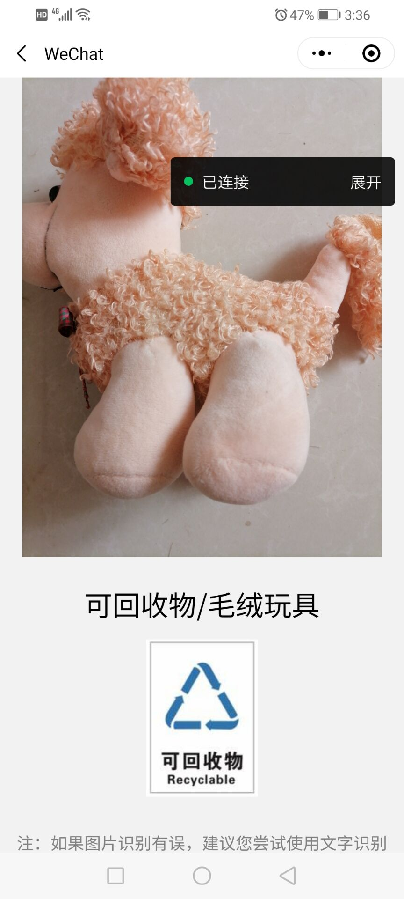
  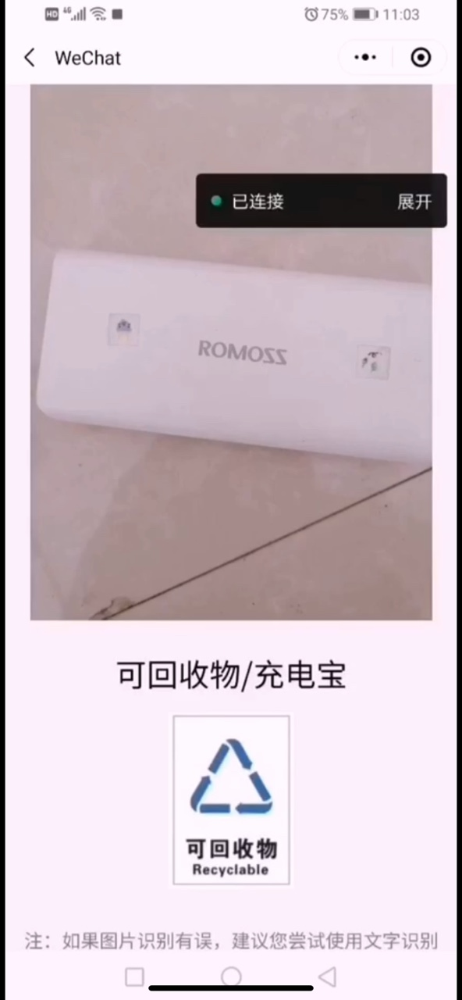

  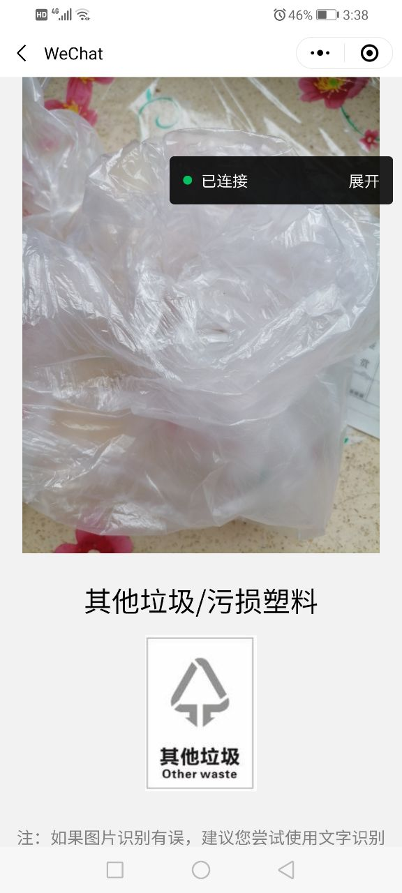
  
  

  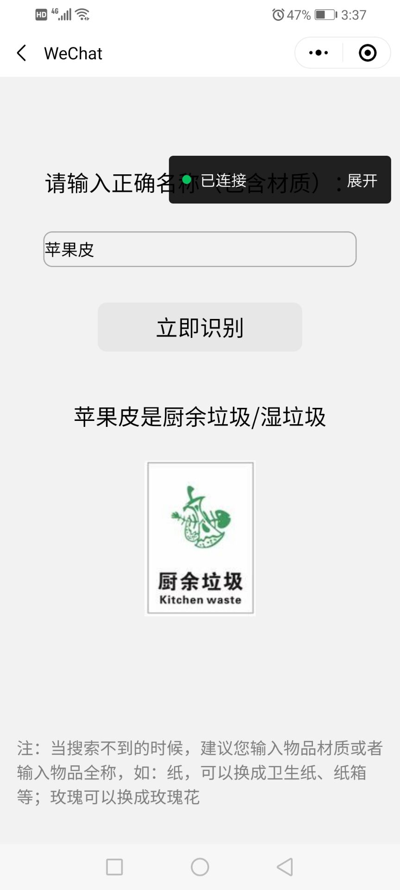
  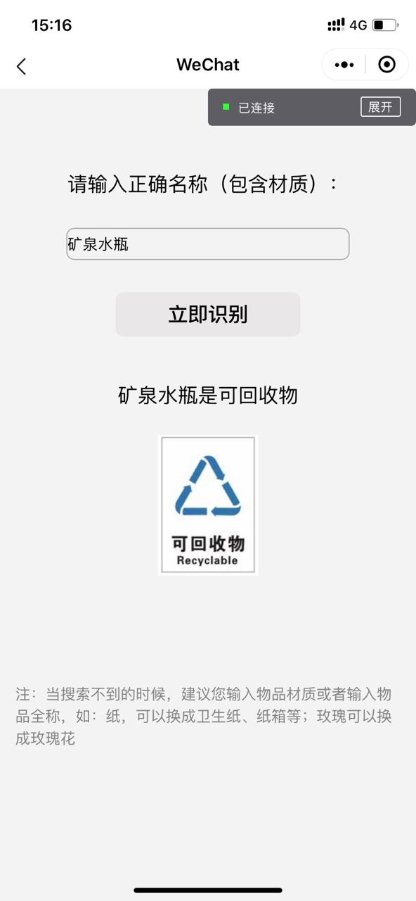
  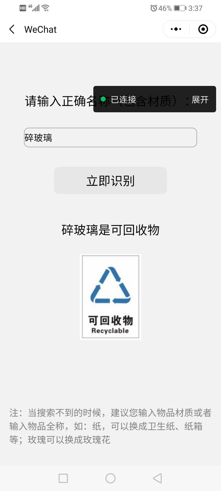

  
  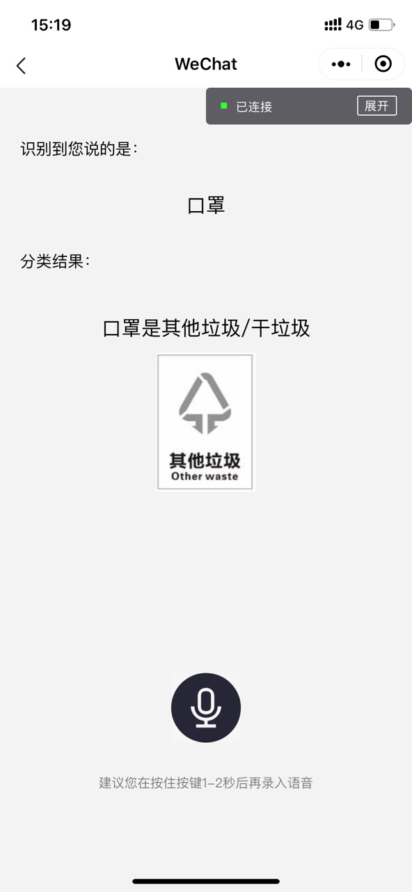
  

