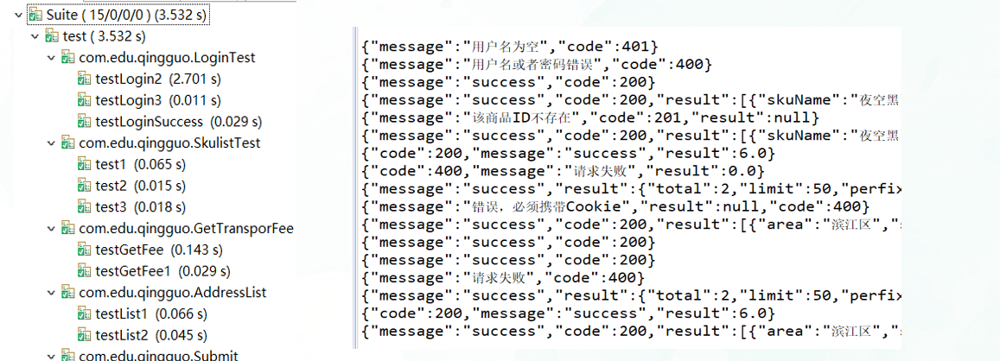
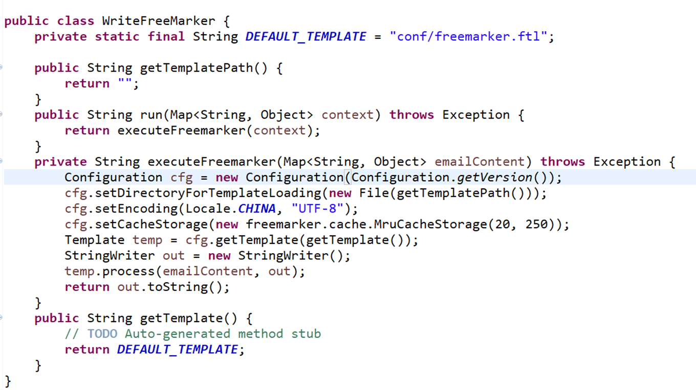
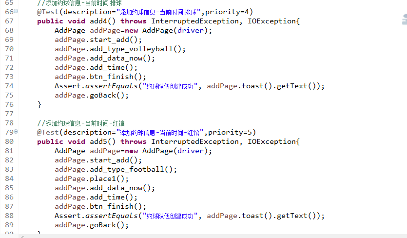
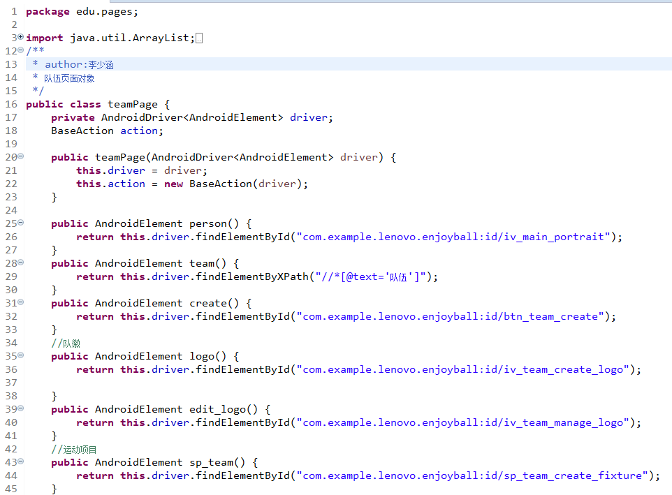
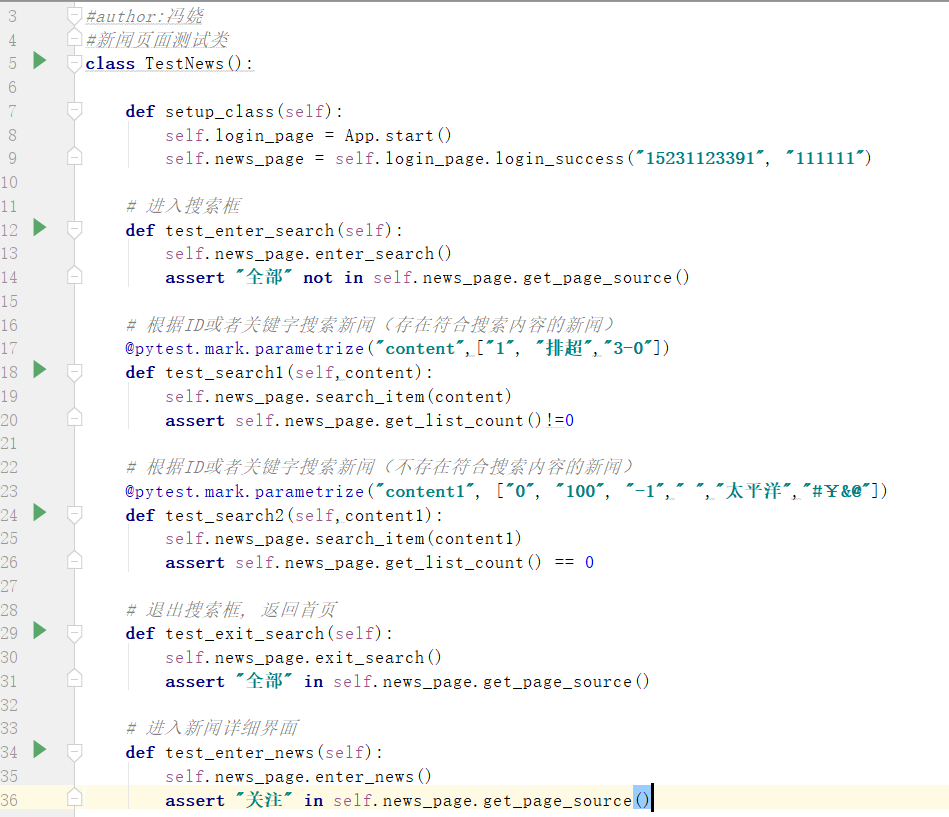
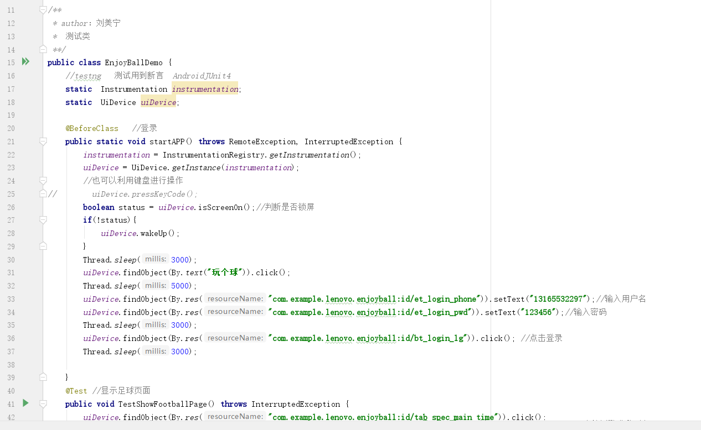
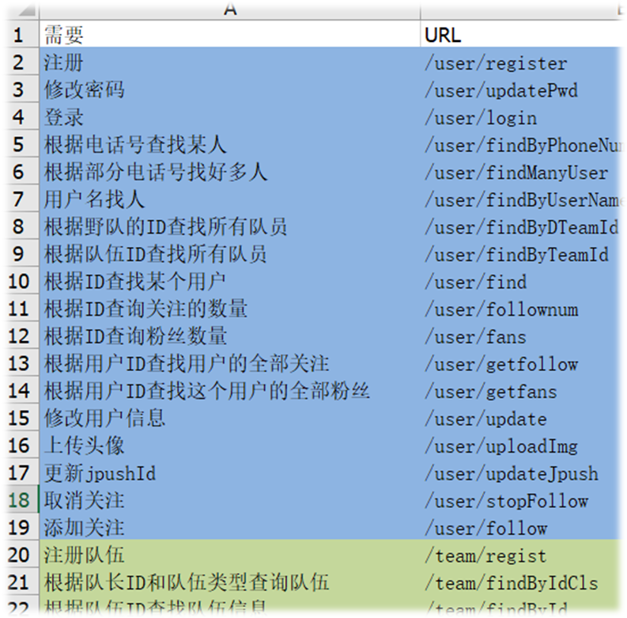

# 2017级项目实训成果展示 

## 《SG小组》 -  软件测试

###  项目简介

本次测试项目为“EnjoyBall”和“Discuz论坛”。“EnjoyBall”是一款发起约球运动的APP。Discuz论坛是一个进行网上发帖的社交论坛。针对项目特性并深入用户的高频使用场景定制了一系列的测试用例、自动化测试脚本和性能测试场景。并在测试过程中发现了导致软件崩溃退出，操作无响应等缺陷。

### 项目成员

- 李少涵、贾伟雯、冯娆、李子冉、杨柳、刘美宁、赵若曦

#### 展示视频

- [项目展示视频](https://www.bilibili.com/video/BV12D4y1D72i)

### 项目截图

