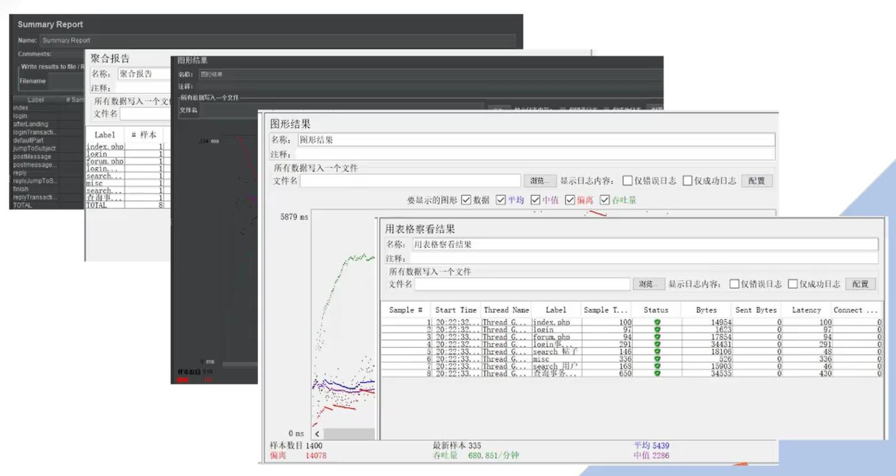
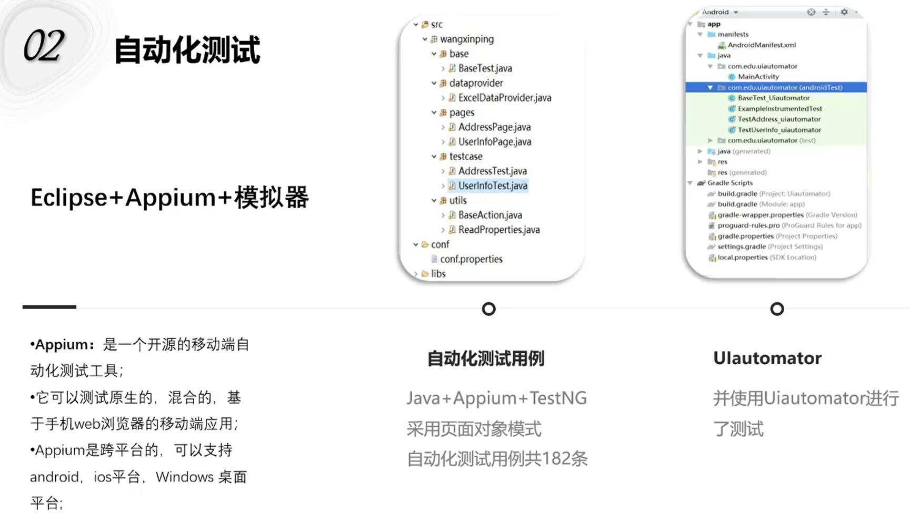
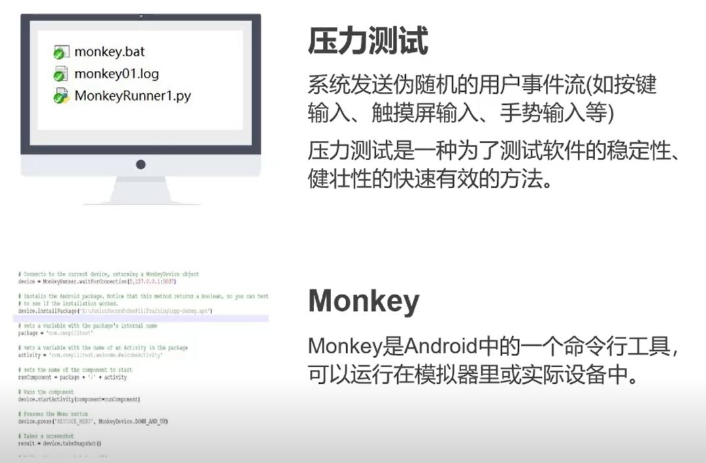
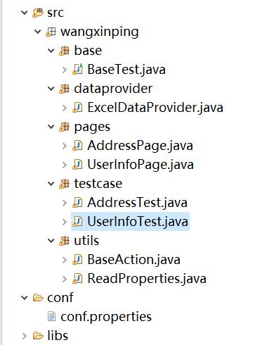
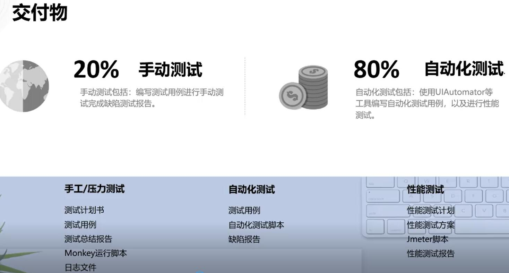
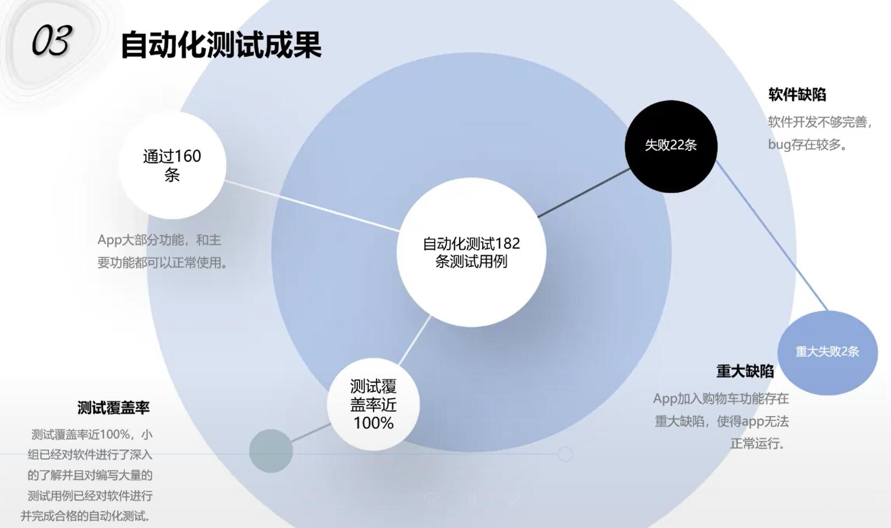

# 2017级项目实训成果展示 

## 《贝坷勒小组》 -  软件测试

###  项目简介

测试项目是“一丸”，它是一款为医患及时沟通以及药品选购的社区医疗服务系统。测试过程中使用Java+Appium进行自动化测试，还使用了Monkey和JMeter进行压力(稳定性)测试。

### 项目成员

- 王欣平、李晓月、王欣平、靳明明、杨久鹏、袁康、杨硕、王语晗

### 项目截图

